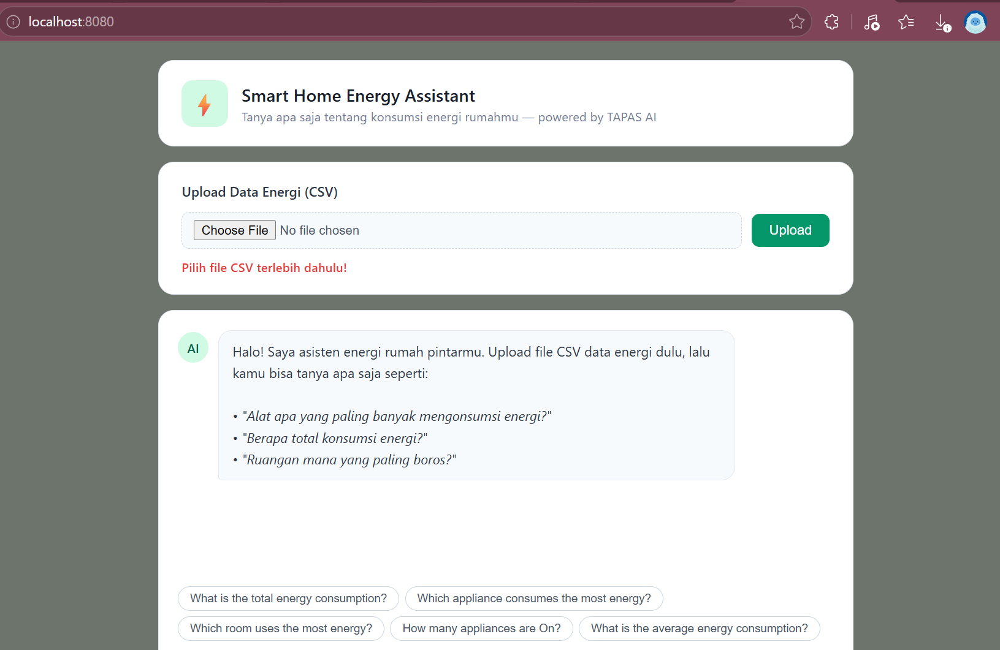
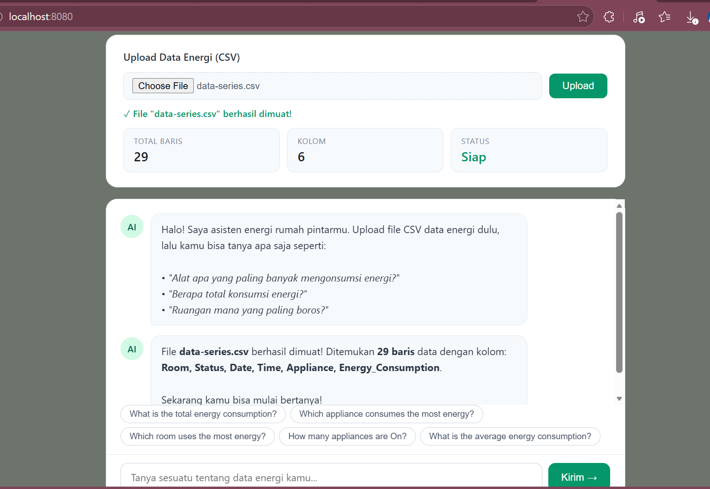
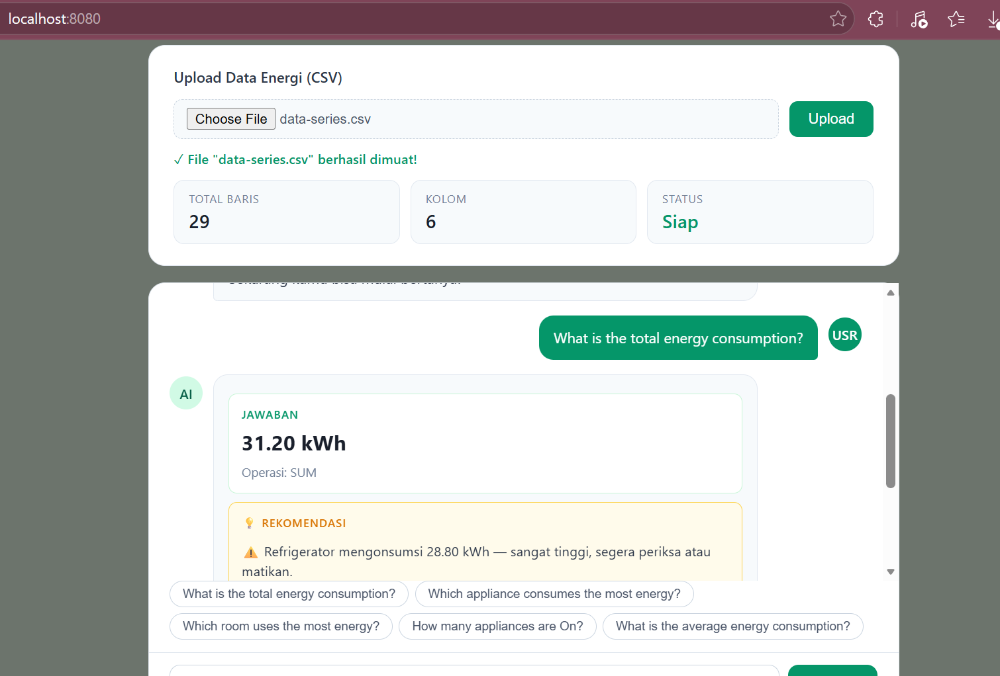
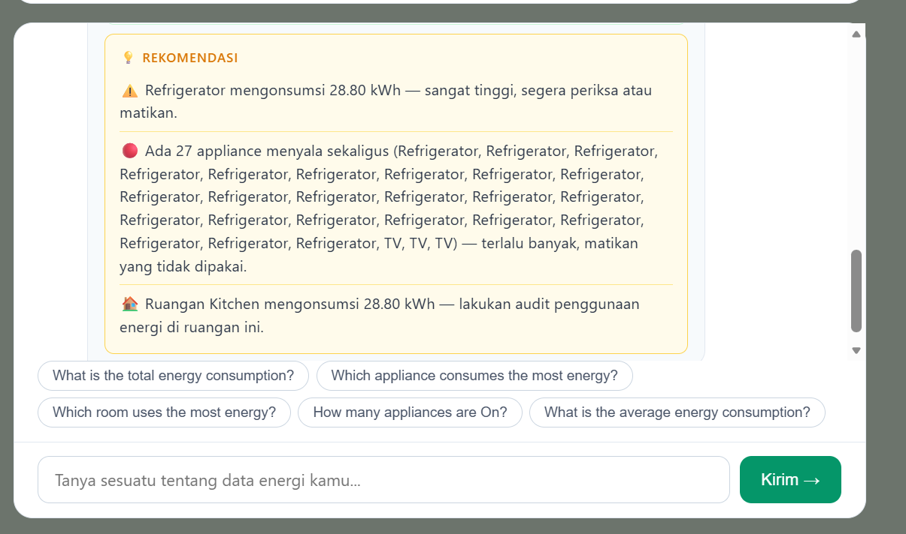

# Final Project AI-Powered Smart Home Energy Management System RE-Code#1


> Studi Independen Bersertifikat — Kampus Merdeka, Kemdikbudristek - Ruangguru


Aplikasi berbasis AI untuk menganalisis konsumsi energi rumah tangga dari data CSV dan memberikan rekomendasi penghematan secara otomatis. Dibangun menggunakan Go sebagai backend dan TAPAS (Google, via HuggingFace) sebagai model AI untuk query berbasis tabel. dikembangkan sebagai bagian dari program **Studi Independen Bersertifikat Kampus Merdeka, Kemdikbudristek**.

> ## 🔄 Re-Code Evolution
> ### Previous Version (ProjectRAW)
> - Hanya menggunakan TAPAS
> - Berbasis CLI sederhana
> - Tidak ada interface Web
> - Jawaban TAPAS masih mentah
> - Tidak ada integrasi LLM lanjutan
> - Pertanyaan rekomendasi tidak terbaca
> - Lihat Repository projectRAW disini: https://github.com/raraend/MSIBProjectRAW
> ### Current Version (Re-Code #1)
> - Menggunakan TAPAS untuk query data tabel
> - Berbasis Web Sederhana
> - Pertanyaan Rekomendasi dapat di jawab berdasarkan aggregasi konsumsi energi per perangkat, status, dan ruangan
> - Dapat mengUpload file CSV terpisah
> ## Tantangan yang Dihadapi
> - GPT-2 tidak tersedia via HuggingFace Inference API untuk kebutuhan project ini, jadi tidak bisa digunakan sebagai model percakapan.

## Lihat Repository ReCode#2 disini: https://github.com/raraend/MSIBProject-ReCode_2.git sebagai bagian dari penyempurnaan project dan pengintegrasian Model AI Groq (Llama 3.1).

---

## Daftar Isi

- [Demo](#demo)
- [Fitur](#fitur)
- [Tech Stack](#tech-stack)
- [Arsitektur Sistem](#arsitektur-sistem)
- [Cara Kerja AI](#cara-kerja-ai)
- [Instalasi](#instalasi)
- [Penggunaan](#penggunaan)
- [Format CSV](#format-csv)
- [Struktur Folder](#struktur-folder)
- [Kontak](#kontak)

---

## Demo

**Mode Web**
- Tampilan upload file csv secara terpisah


- Tampilan saat file csv terupload dan data terbaca


- Tampilan saat pertanyaan terjawab


- Tampilan rekomendasi yang menghitung aggregasi secara manual


---

## Fitur

- **Upload file CSV** langsung dari browser
- **Tanya jawab natural** berbasis data tabel menggunakan TAPAS
- **Rekomendasi otomatis** berdasarkan aggregasi konsumsi energi per perangkat, status, dan ruangan
- **Web Interface** — diakses melalui browser, tidak perlu CLI
- **Fallback handling** — menampilkan pesan error yang informatif jika koneksi ke API gagal
- **Dukungan aggregasi** — SUM, COUNT, dan lookup langsung

---

## Tech Stack

**AI**


**API**


**Frontend (Web Mode)**


**Backend**


---

## Cara Kerja

```
User Input (pertanyaan)
        │
        ▼
┌──────────────────────┐
│  TAPAS (HuggingFace) │  ← query dikirim bersama tabel CSV
│  Jawab dari tabel    │
└──────────┬───────────┘
           │
           ├── Aggregator: SUM  → hitung total kWh
           ├── Aggregator: COUNT → hitung jumlah item
           └── Aggregator: NONE  → lookup langsung
                    │
                    ▼
        ┌────────────────────┐
        │  Rule-based Engine │  ← rekomendasi dari kode Go
        │  (generateRecomm.) │
        └────────────────────┘
                    │
                    ▼
             Response ke Browser
```

**Rule-based Recommendation Logic:**
- Perangkat dengan konsumsi > 10 kWh → peringatan kritis 
- Perangkat dengan konsumsi > 5 kWh → saran pembatasan 
- Lebih dari 5 perangkat menyala bersamaan → peringatan 
- Ruangan dengan konsumsi > 8 kWh → saran audit 

---

##  Instalasi

### Prasyarat
- Go `>= 1.21`
- Akun HuggingFace dengan API token aktif

### Langkah

```bash
# 1. Clone repositori
git clone https://github.com/raraend/MSIBProject_ReCode_1.git
cd MSIBProject_ReCode_1

# 2. Install dependensi
go mod tidy

# 3. Buat file .env
cp .env.example .env
```

Isi file `.env`:
```env
HUGGINGFACE_TOKEN=hf_xxxxxxxxxxxxxxxxxxxxxxxx
```

Dapatkan token di: https://huggingface.co/settings/tokens

```bash
# 4. Jalankan server
go run main.go
```

Buka browser dan akses: **http://localhost:8080**

---

## Format CSV

File CSV yang diunggah harus memiliki kolom berikut:

| Kolom | Tipe | Keterangan |
|-------|------|------------|
| `Date` | string | Tanggal pencatatan |
| `Appliance` | string | Nama perangkat (AC, TV, dll.) |
| `Room` | string | Ruangan tempat perangkat berada |
| `Status` | string | `On` atau `Off` |
| `Energy_Consumption` | float | Konsumsi energi dalam kWh |

### Contoh Isi CSV

```csv
Date,Appliance,Room,Status,Energy_Consumption
2024-01-01,AC,Bedroom,On,1.5
2024-01-01,TV,Living Room,On,0.3
2024-01-01,Refrigerator,Kitchen,On,0.8
2024-01-02,AC,Bedroom,Off,0.0
2024-01-02,Washing Machine,Bathroom,On,2.1
```

---

## Contoh Pertanyaan

Pertanyaan-pertanyaan ini dapat diajukan melalui Web Interface setelah CSV diunggah:

```
What is the total energy consumption?
Which appliance uses the most energy?
How many times was the AC turned on?
What is the energy consumption of the TV?
How many appliances are currently on?
```

### Contoh Output

```
Pertanyaan : What is the total energy consumption?
Jawaban    : 4.70 kWh
Aggregator : SUM

Rekomendasi:
AC mengonsumsi 12.30 kWh — sangat tinggi, segera periksa atau matikan.
TV mengonsumsi 6.20 kWh — pertimbangkan untuk membatasi penggunaannya.
Konsumsi ruangan lain dalam batas normal.
```

---

##  Struktur Folder

```
MSIBProject_ReCode_1/
├── main.go              # Entry point — handler & logika utama
├── templates/
│   └── index.html       # Halaman web (UI)
├── data-series.csv      # Contoh file CSV
├── .env                 # API keys (tidak di-commit)
├── .env.example         # Template .env
├── go.mod
├── go.sum
└── README.md
```

---

##  Rencana Re-Code #2

Versi berikutnya akan mengatasi keterbatasan Re-Code #1 dengan:

- Integrasi **Groq (LLaMA 3.1)** sebagai AI Router dan Recommendation Engine
- Mengganti rule-based recommendation dengan **rekomendasi berbasis LLM** yang lebih natural
- Dukungan **CLI mode** di samping Web Interface
- **Fallback mechanism** otomatis dari TAPAS ke Groq
---

## 👤 Kontak

**Rara Eva Maharani**
- Email: raarevamaharani@gmail.com
- GitHub: [@raraend](https://github.com/raraend)

---

*Repositori ini dikembangkan sebagai bagian dari program Studi Independen Bersertifikat Kampus Merdeka, Kemdikbudristek — 2025.*

<br>
<br>
<br>
<br>

# README LAMA BERISI FLOW PENGERJAAN DARI RUANGGURU

## Artificial Intelligence menggunakan Golang Final Project AI-Powered Smart Home Energy Management System

### Description

Kamu akan mengembangkan Sistem Manajemen Energi Rumah Pintar menggunakan Golang dan [model AI Tapas](https://huggingface.co/google/tapas-base-finetuned-wtq) dari Huggingface Model Hub. Sistem ini akan memprediksi dan mengelola penggunaan energi dalam lingkungan rumah pintar. Aplikasi ini akan menerima data tentang penggunaan energi rumah dan memberikan wawasan dan rekomendasi tentang cara mengoptimalkan konsumsi energi.

Fitur:

- Prediksi Konsumsi Energi: Sistem ini akan memprediksi konsumsi energi rumah berdasarkan data historis.

- Rekomendasi Penghematan Energi: Sistem ini akan memberikan rekomendasi tentang cara menghemat energi berdasarkan konsumsi energi yang diprediksi.

Data input dalam bentuk format CSV dengan kolom berikut:

- Date: Tanggal data penggunaan energi.
- Time: Waktu data penggunaan energi.
- Appliance: Nama alat.
- Energy_Consumption: Konsumsi energi alat dalam kWh.
- Room: Ruang tempat alat berada.
- Status: Status alat (On/Off).

Contoh:

```txt
Date,Time,Appliance,Energy_Consumption,Room,Status
2022-01-01,00:00,Refrigerator,1.2,Kitchen,On
2022-01-01,01:00,Refrigerator,1.2,Kitchen,On
...
2022-01-01,08:00,TV,0.8,Living Room,Off
2022-01-01,09:00,TV,0.8,Living Room,On
2022-01-01,10:00,TV,0.8,Living Room,On
...
```

Untuk contoh, kalian bisa menggunakan file yang telah disiapkan `data-series.csv`.

#### Penggunaan Model AI:

Model AI Tapas `tapas-base-finetuned-wtq` akan digunakan untuk memahami data tabel dan membuat prediksi tentang konsumsi energi masa depan. Model ini akan menerima file CSV sebagai input dan menghasilkan prediksi untuk total konsumsi energi hari berikutnya.

Buatlah interface untuk aplikasi ini, bisa berupa aplikasi CLI maupun Web Application. Silahkan dikembangkan sehingga mirip dengan chatbot dimana user bisa bertanya mengenai data-data yang ada di file input.

Silahkan menggunakan model AI lainnya dari Hugging Face Hub untuk membuat aplikasi ini lebih menarik, misal-nya dengan menambahkan model AI `openai-community/gpt2` agar bisa memberikan rekomendasi tentang alat apa yang bisa digunakan lebih sedikit untuk menghemat energi.

### Constraints

Function `CsvToSlice` dan `ConnectAIModel` sudah diberikan dan wajib kalian gunakan. Silahkan membuat function-function lain yang kalian perlukan.

### Test Case Examples

#### Test Case CsvToSlice

**Input**:

```txt
"Name,Age\nJohn,30\nDoe,40"
```

**Expected Output / Behavior**:

{
    "Name": ["John", "Doe"],
    "Age": ["30", "40"]
}

**Explanation**:

Fungsi CsvToSlice menerima string dari file CSV sebagai input dan mengembalikan `map` di mana `key`-nya adalah header kolom dan `value`nya adalah data untuk setiap kolom. Dalam hal ini, string CSV input memiliki dua kolom "Name" dan "Age", dan dua baris data "John, 30" dan "Doe, 40". Fungsi ini harus mengembalikan map dengan dua data. Data pertama harus memiliki key "Name" dan value ["John", "Doe"], dan key kedua harus memiliki key "Age" dan value ["30", "40"].

#### Test Case 2

**Input**:

```txt
Payload: {
    "table": {
        "Name": ["John", "Doe"],
        "Age": ["30", "40"]
    },
    "query": "What is the age of John?"
}
```

**Expected Output / Behavior**:

```txt
{
    "answer": "30",
    "coordinates": [[0, 1]],
    "cells": ["30"],
    "aggregator": ""
}
```

**Explanation**:

Fungsi ConnectAIModel menerima payload dan Huggingface Token sebagai input dan mengembalikan struktur Response. Payload adalah struktur yang berisi `Table` dan `Query`. `Tabel` adalah sebuah map di mana `key`-nya adalah header kolom dan `value`-nya adalah irisan yang berisi data untuk setiap kolom. `Query` adalah string yang mewakili pertanyaan tentang data di tabel. Dalam hal ini, querynya adalah "Berapa umur John?". Fungsi ini harus mengembalikan struktur Response dengan jawaban "30", koordinat [[0, 1]], sel ["30"], dan aggregator.

Happy Coding!